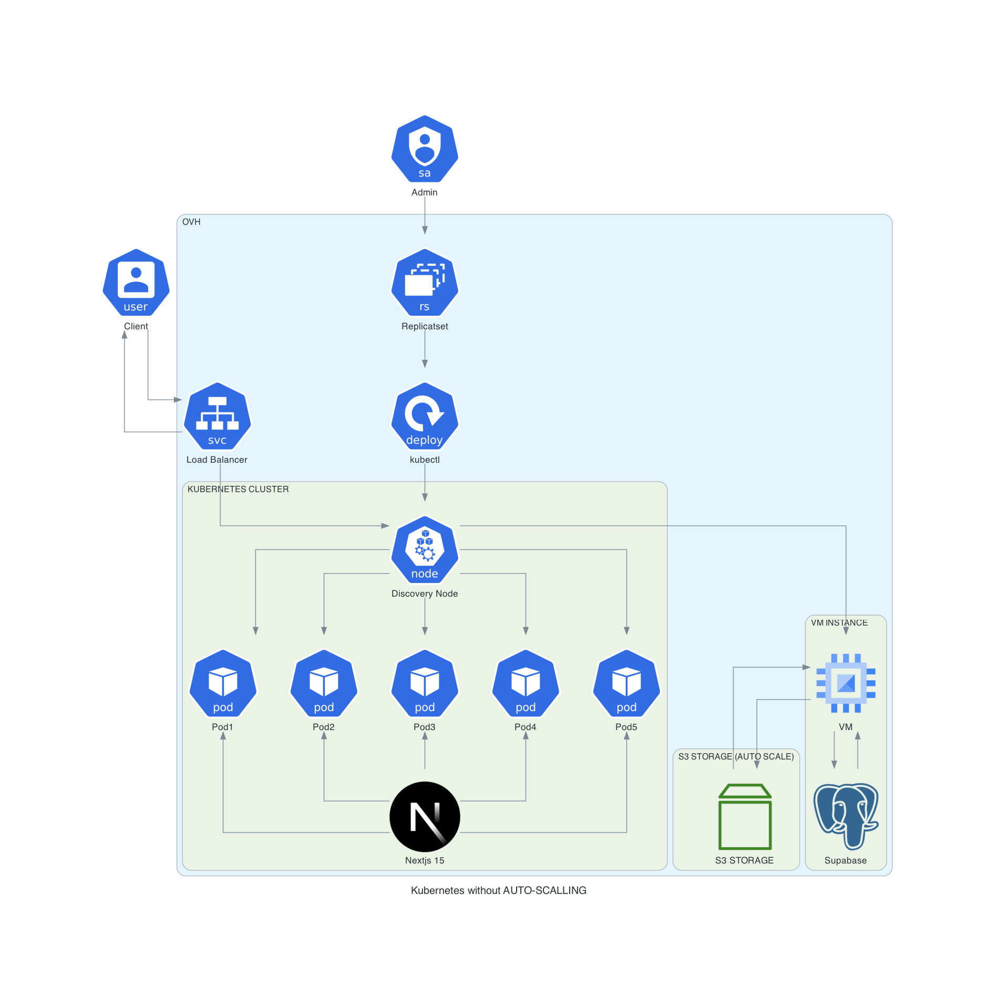

# K8s Demo App - OVH Infrastructure Setup



## Overview

This repository deploys the complete OVH infrastructure using **Terraform**. Terraform manages the provisioning and configuration of all components including Kubernetes, so no separate actions are required for Ansible or Python scripts.

## Prerequisites

- **OVH Account:** You must have an account on [OVH](https://www.ovh.com).
- **Terraform:** Download and install [Terraform](https://www.terraform.io/downloads.html).

> **:information_source: Tip:** Always use the latest stable version of Terraform for best results.

## Installation & Setup

1. **Clone the Repository**

   Open your terminal and run:

   ```bash
   git clone https://github.com/Oksitaine/SupabaseOVH.git
   cd SupabaseOVH
   ```

2. **Configure OVH & Terraform Variables**

   Prepare your OVH credentials and project details. Configure them in the `variable.auto.tfvars` file. For example:

   ```hcl
   # variable.auto.tfvars
   variable "ovh_keys" {
       type        = map(string)
       description = "Oauth token for OVH API"
       default = {
           # For connecting to your OVH account with Terraform:
           endpoint           = "ovh-eu"
           application_key    = "your_ovh_application_key"
           application_secret = "your_ovh_application_secret"
           consumer_key       = "your_ovh_consumer_key"

           # For creating an S3 container (workaround for OVH provider limitations)
           api_ovh            = "your_ovh_api_token"
       }
   }

   # Add any additional configuration as required
   ```

   > **:warning: Warning:** Double-check the configuration in `variable.auto.tfvars` before running any Terraform commands to avoid deployment issues.

> **:warning: Warning:**  
> When selecting a specific zone for storage and instances, be sure to:
> - Pre-authorize the chosen regions in your OVH settings. OVH may block regions that have not been pre-authorized.
> - If you decide not to use the Local Zone for the S3 bucket, manually attach the created user to the S3 bucket via the OVH dashboard, as this configuration is not done automatically.
  
3. **Deploy with Terraform**

   Initialize Terraform and apply your infrastructure plan:

   ```bash
   terraform init
   terraform plan   # Review the execution plan carefully
   terraform apply  # Confirm to deploy the resources
   ```

   Wait for Terraform to complete the deployment process. This step provisions the Kubernetes cluster and all associated resources automatically.

4. **Post-Deployment**

   Once Terraform finishes, it will output important details such as API endpoints and IP addresses for accessing your services, including the Supabase dashboard. Use these outputs to interact with your deployed infrastructure.

## Testing & Troubleshooting

- **Terraform Errors:**  
  If errors occur during `terraform init` or `terraform apply`, check your OVH credentials and the configuration in the `variable.auto.tfvars` file.

- **General Debugging:**  
  Review the Terraform output and logs. Consider using detailed logging options if you run into issues.

> **:information_source: Tip:** Test your changes in a staging environment before applying them to production.

## Conclusion

This repository uses Terraform to fully manage the OVH infrastructure, including Kubernetes cluster provisioning and all necessary configurations. After applying the Terraform plan, review the output details to manage and access your deployed services.

---

### References

- [Terraform Documentation](https://www.terraform.io/docs)
- [OVH Documentation](https://docs.ovh.com)

> **Note:** When creating storage, be mindful of the local zone versus other regions. The first time you create storage in OVH, you may need to accept notifications for the new region.